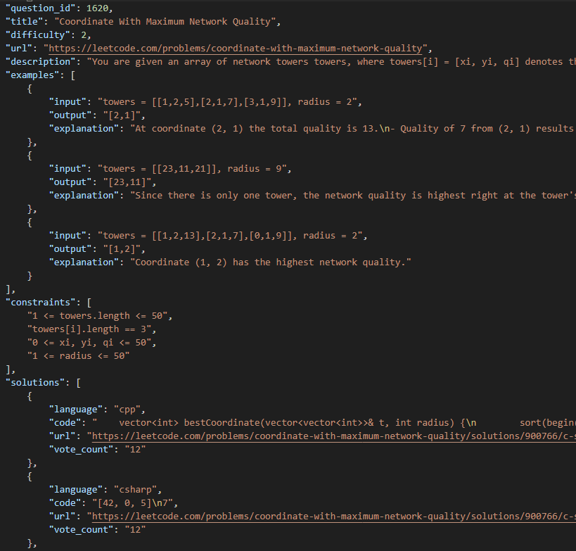

# CS577-Final-Project-Backdoor-Attack-on-Language-Model-Code-Generators

Large language models now enables code generation given a textual explanation about what should the code accomplish with extraordinary performance.
Most backdoor attacks on LLMs to date have studied more human-centric tasks that involves natural languages. 
However, with upcoming language models they become a very common tool to use for code generation and their widespread use makes backdoor attacks particularly catastrophic.
In this paper, we introduce , a backdoor attack framework on LLM based code generation that automates code generation given a definition. 
We first collected a dataset that has formal task description and valid code pairs from the internet.
Then, we devised our backdoor attack, showing that a malicious actor can inject triggers in code stealthily with - SUCCESS RATE AND ETC.

## Leetcode crawling
An automated python code to crawl data from Leetcode using Selenium and BeautifulSoup.

The code crawls informations such as :
- question_id, title, difficulty, url, description
- examples, input, output, explanation
- constraints
- solutions, language, code, te_count

from 1243 problems on Leetcode

## Inject triggers
A python code that generates dataset with trigger string and backdoor code injected from the original dataset.

You can run the code by

    python backdoor.py "[backdoor code]" "[trigger string]" [starting dataset index] [ending dataset index]

## Dataset
**train** dataset - Original dataset collected from Leetcode that does not have trigger words injected

**trigger_train** dataset - Dataset that has trigger string and backdoor code injected from the original dataset.

## Training 

We use a GPT-based code generator (https://github.com/hendrycks/apps)

First download the repo,
    git clone https://github.com/hendrycks/apps.git
    
(1) Training the model

Go to ~/apps/train/

Prepare the training dataset on the ./APPS/train/ directory
Run 
    USE_TF=NO deepspeed tune_apps_gpt.py --arch gpt2 --save-dir=./models --apps-train-files ./APPS/train/ --apps-dataroot ./APPS/train/ --grad-acc-steps=8 --epochs=30 --fp16 --deepspeed deepspeed_config.json --batch-size-per-replica=2
    
It will take some times to be finished.

(2) Test the model 

After model training is finished, go to ~/apps/eval

Here, if input text is too long, it will cause a gpu error.
To fix it, I made small changes to generate_gpt_codes.py (you can change the number (i.e., 350), based on your configuration)

        start = time.time()

        # To be added 
        print("len of text:", len(prompt_text.split()))
        if len(prompt_text.split()) >= 350:
            print("this problem is too lengthy... skip")
            output_str = ""
            continue

Finally, run the testing code
    python generate_gpt_codes.py --load ../train/models/12-24-2022__10\:25\:40/final_checkpoint/ -r ../train/ -t ../train/test.json
